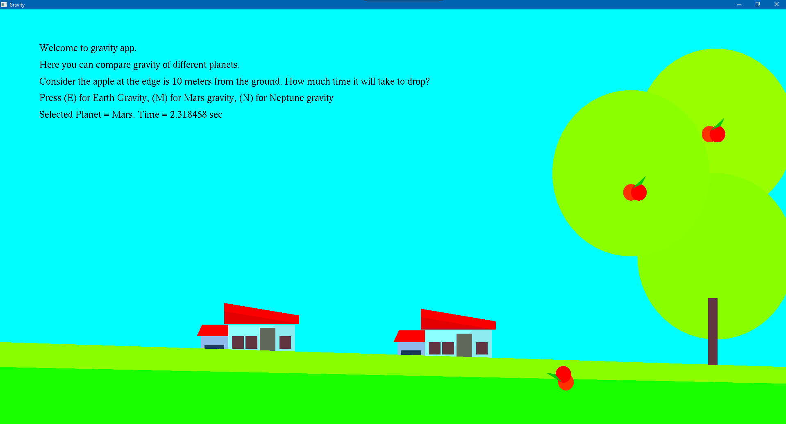

# Simple Gravity App with freeglut

This project provides a simple interactive visualization tool that allows users to explore and compare the effects of gravity on falling objects on different planets. It uses the freeglut library for rendering graphics.

# Features
- Visualization of gravity effects on falling objects(apple).
- Comparison of gravity strength on different planets.
- Interactive controls to change parameters such as planet selection.

# Prerequisites
- C/C++ compiler
- freeglut library. [Refer to this tutorial](https://youtu.be/7rLo69vCooU?si=d1iqBGpwfx4zGqFt)

# Screenshots




# Installation
- Clone or download the repository to your local machine.
```bash
git clone https://github.com/shz-code/gravity-computer-graphics
```
- Install freeglut library if you haven't already.
- Compile the source code using the provided makefile or your preferred build system.

# Usage
- Run the compiled executable.
- Use keyboard or mouse controls to interact with the visualization.
- Select different planets to see their gravity effects.

# Controls
- Use Mouse to stop and start animation.
- Press keys E, M, N to select different planets.

# License
This project is licensed under the MIT License.

# Acknowledgements
This project was inspired.